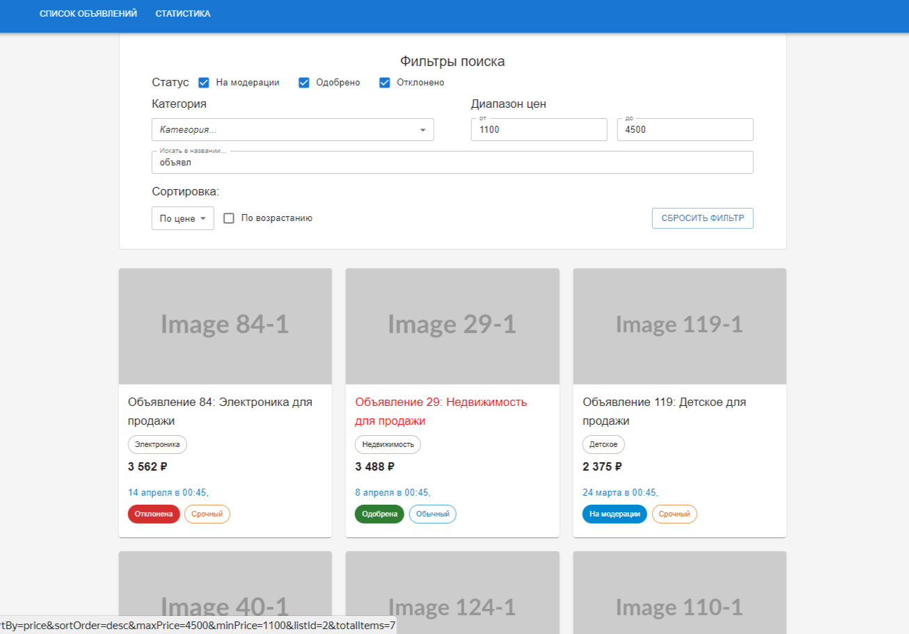
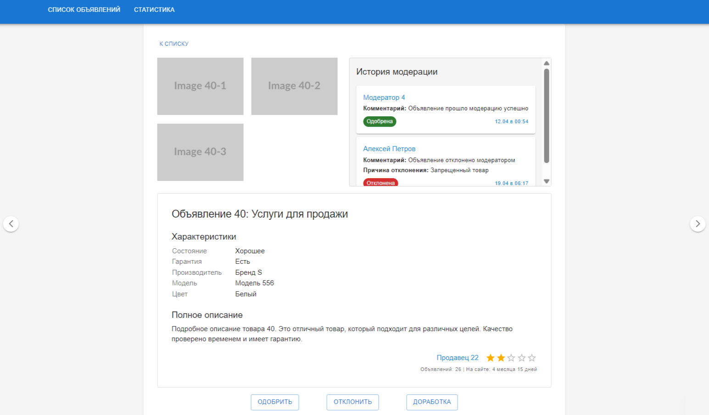
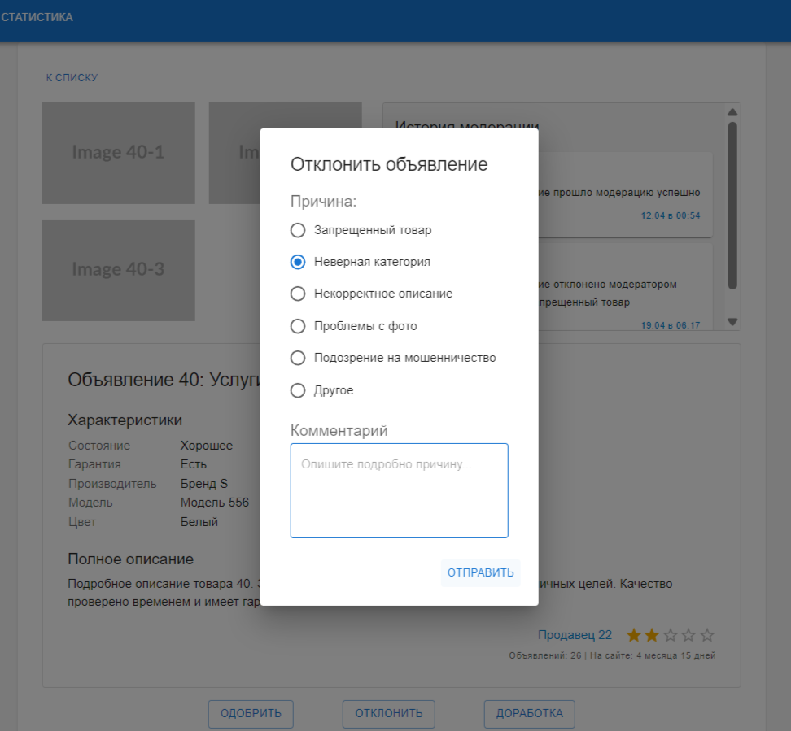
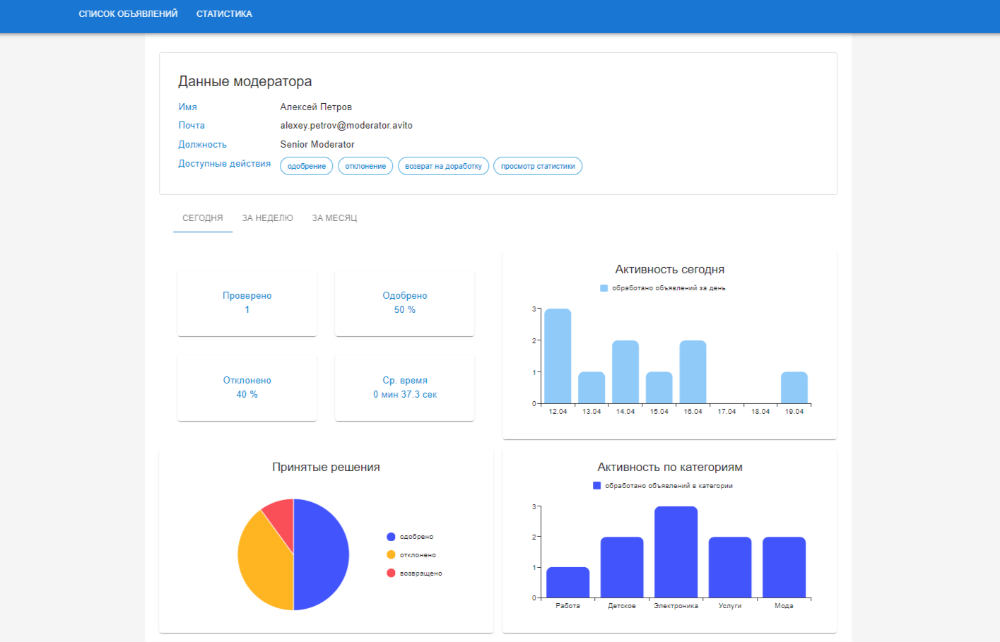
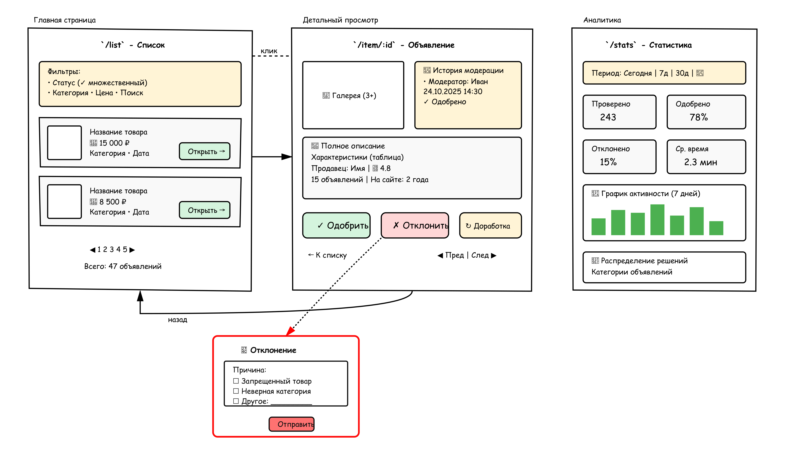

# Приложение для модерации объявлений

### Запуск

**1) Запуск фронтенд-части**    
- В командной строке переместиться в папку frontend-next ~~(старая версия приложения: frontend)~~
- npm run dev ~~(старая версия приложения: npm start)~~

**2) Запуск сервера**
- В командной строке переместиться в папку server
- npm start

Приложение состоит из трех страниц:
- Страница с просмотром всех объявлений (фильтр, сортировка, пагинация)

- Страница с полной информацией об объявлении (история действий с ним, полное описание с характеристиками) и возможностью обработать объявление (одобрить, отклонить, вернуть на доработку). Отклонение и возврат приводят к появлению окна, в котором необходимо указать причину.

- Страница с данными об активности авторизованного модератора (распределение категорий в обработанных объявлениях, распределение активности по дням в заданный период, распределение принятых решений)

## Функционал приложения:

